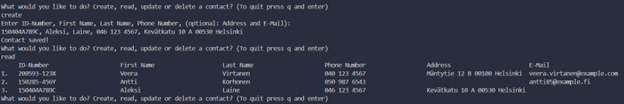
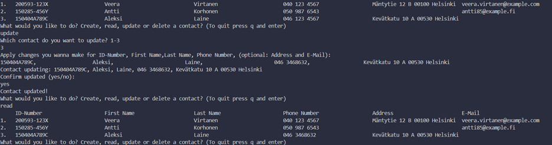
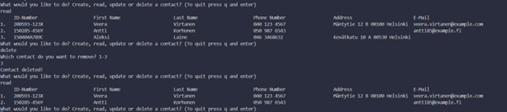

# java_project_work

<h2>Contacts App</h2>

Contacts App is a command line user interface application where you can store contacts.

## Description
This application is a simple Java-based application to manage contact information stored in a CSV file. This application provides features to
create, read, update and delete contacts that are validated to provide
correct form of information.

## Features
- Create a contact
- Read contacts
- Update contacts
- Delete contacts

## Structure
- Validation.java: Handles input validation for the user input.
- Choises.java: Implements create, update and delete funtionalities.
- Info.java: Represents a contact object.
- MyFile.java: Manages reading and writing to a CSV file.

## Tests
Creating a contact and reading the file

Updating a contact

Deleting a contact  

## Usage

Run the App using this command:  
cd src/ && javac *.java && java ContactsApp

Type create, read, update or delete to choose the action and follow the instructions.

<kbd>q + enter</kbd> - Quit the App.

## Screencast
Watch it <a href="https://youtu.be/lhuKIVQTDJI">here</a>.

## Sources

Regex:
https://www.jrebel.com/blog/java-regular-expressions-cheat-sheet  
https://regex101.com/library/cIohyA (finnish ID)  
https://stackoverflow.com/questions/66910411/regular-expression-to-validate-a-name (name)  
https://ihateregex.io/expr/phone/ (phone number)  
https://ihateregex.io/expr/email (email)  

PrintWriter:
https://www.youtube.com/watch?v=c9L2rJt20qQ (writing to a csv file)  

Reader:
https://www.digitalocean.com/community/tutorials/java-read-file-line-by-line  
https://www.geeksforgeeks.org/split-string-java-examples/ (split.line)  
https://www.geeksforgeeks.org/java-io-filereader-class/  
https://www.w3schools.com/java/ref_string_format.asp (format)  
https://www.studytonight.com/java-examples/reading-a-csv-file-in-java  
https://www.youtube.com/watch?v=JFc_8oq7yLM  
https://www.baeldung.com/java-csv-file-array (array)  

Update:
https://www.youtube.com/watch?v=TpyRKom0X_s  

Delete:
https://www.youtube.com/watch?v=NceIYifVAQQ  

Errors and Exections:
https://stackoverflow.com/questions/15722763printing-exception-message-in-java  
https://rollbar.com/blog/how-to-throw-illegalargumentexception-in-java/  
https://www.youtube.com/watch?v=EDIIXLL24pk  

Graphical user interface:
https://www.youtube.com/watch?v=vego72w5kPU  
https://docs.oracle.com/javase/8/docs/api/javax/swing/JTable.html (table)  
https://www.youtube.com/watch?v=ccUdvsj4L0U (table)  

ReadMe inspo:
https://github.com/akashnimare/foco/blob/master/readme.md  

Others:
https://stackoverflow.com/questions/23283041/how-to-make-java-delay-for-a-few-seconds (thread sleep)  
https://www.youtube.com/watch?v=WEZRc0GoP3E (writing to text file)  
https://mkyong.com/java/how-to-export-data-to-csv-file-java/ (writing to csv file)  
https://www.youtube.com/watch?v=WEZRc0GoP3E (writing to text file)  
https://www.programiz.com/java-programming/printwriter (printwriter)  
https://www.geeksforgeeks.org/difference-between-bufferedreader-and-filereader-in-java/  
https://www.geeksforgeeks.org/writing-a-csv-file-in-java-using-opencsv/  
